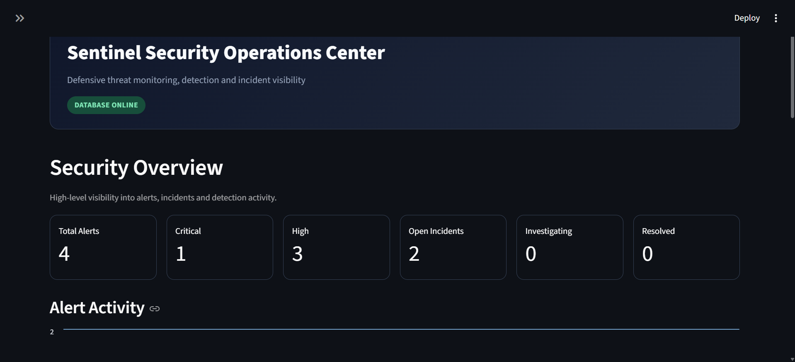
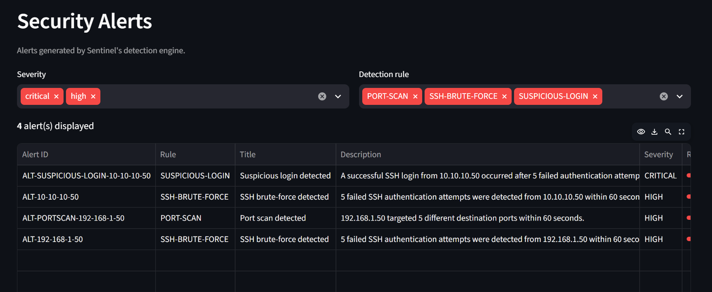
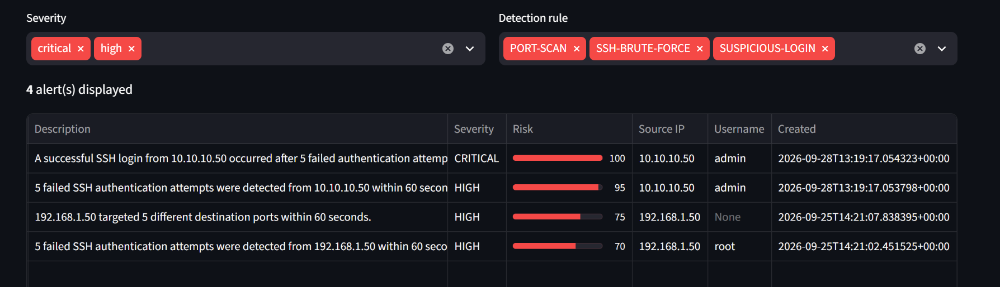
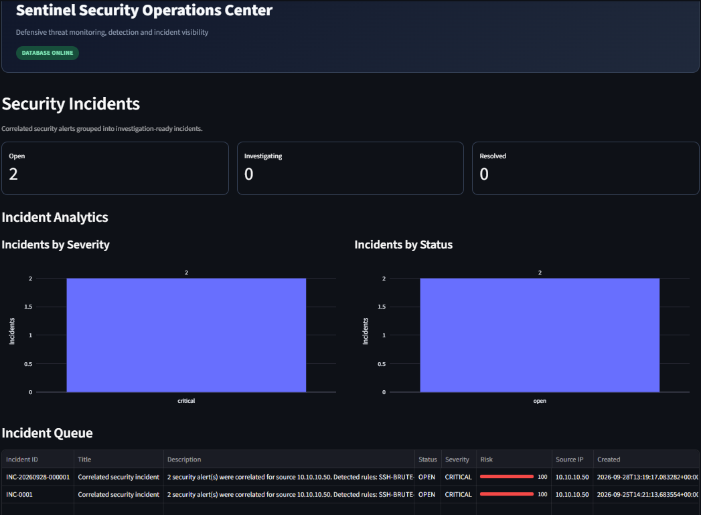

# Sentinel

**Defensive cybersecurity monitoring and threat detection platform built with Python.**

Sentinel is a modular security monitoring platform designed to ingest security events, detect suspicious activity, enrich alerts with threat intelligence, calculate risk, and correlate related alerts into incidents.

The project is designed as a practical cybersecurity engineering portfolio demonstrating detection logic, security data processing, automated testing, persistence, API development, and security-focused software architecture.

---

## Features

* **Security event ingestion and normalization**
* **Rule-based threat detection**
* **SSH brute-force detection**
* **Port-scan detection**
* **Suspicious-login detection**
* **Risk scoring**
* **Threat-intelligence enrichment**
* **Alert management**
* **Incident correlation**
* **SQLite persistence**
* **Command-line interface**
* **Authenticated REST API**
* **Automated test suite**
* **Docker deployment configuration**
* **Streamlit SOC dashboard**

---

## Architecture

```text
                         ┌─────────────────────┐
                         │     Security Logs   │
                         └──────────┬──────────┘
                                    │
                                    ▼
                         ┌─────────────────────┐
                         │      Ingestion      │
                         │   & Normalization   │
                         └──────────┬──────────┘
                                    │
                                    ▼
                         ┌─────────────────────┐
                         │   Detection Engine  │
                         │                     │
                         │ • Brute Force       │
                         │ • Port Scan         │
                         │ • Suspicious Login  │
                         └──────────┬──────────┘
                                    │
                                    ▼
                         ┌─────────────────────┐
                         │    Risk Scoring     │
                         └──────────┬──────────┘
                                    │
                     ┌──────────────┴──────────────┐
                     │                             │
                     ▼                             ▼
          ┌─────────────────────┐      ┌─────────────────────┐
          │ Threat Intelligence │      │       Alerts        │
          │      Enrichment     │      └──────────┬──────────┘
          └──────────┬──────────┘                 │
                     │                            ▼
                     └──────────────────►┌─────────────────────┐
                                         │     Incidents       │
                                         │     Correlation     │
                                         └──────────┬──────────┘
                                                    │
                         ┌──────────────────────────┼────────────────────┐
                         │                          │                    │
                         ▼                          ▼                    ▼
                  ┌─────────────┐           ┌─────────────┐      ┌─────────────┐
                  │     CLI     │           │  REST API   │      │ SOC Dashboard│
                  └─────────────┘           └─────────────┘      └─────────────┘
                                                    │
                                                    ▼
                                           ┌─────────────────┐
                                           │ SQLite Storage  │
                                           └─────────────────┘
```
## Security Operations Center Dashboard

Sentinel includes a Streamlit-based Security Operations Center dashboard for monitoring alerts, incidents, detection activity, and security findings.

### Security Overview



### Alerts



### Alert Investigation



### Incidents



---

## Detection Capabilities

### SSH Brute Force

Sentinel identifies repeated SSH authentication failures originating from the same source IP within a defined time window.

Default detection threshold:

```text
5 failed attempts within 60 seconds
```

Detected activity generates a high-severity alert with a calculated risk score.

---

### Port Scan

Sentinel detects sources connecting to multiple distinct destination ports within a short time window.

Default detection threshold:

```text
5 unique ports within 60 seconds
```

This can identify reconnaissance behavior such as rapid service enumeration.

---

### Suspicious Login

Sentinel detects repeated authentication failures that reach a higher-risk threshold.

Default detection threshold:

```text
3 failures within 60 seconds
```

These events are classified as critical and receive elevated risk scoring.

---

## Risk Scoring

Sentinel assigns a numerical risk score to detected activity.

The scoring system considers factors such as:

* Detection severity
* Number of repeated events
* Additional suspicious activity
* Threat-intelligence enrichment

Scores are constrained to a range of:

```text
0 → 100
```

This provides a consistent way to prioritize security alerts.

---

## Threat Intelligence

Sentinel supports threat-intelligence enrichment through local indicator data.

Indicators can contain:

* IP addresses
* Domains
* Indicator type
* Confidence
* Severity
* Source
* Description

Example:

```json
{
  "value": "10.10.10.50",
  "indicator_type": "ipv4",
  "confidence": 90,
  "severity": "high",
  "source": "sentinel-test-feed"
}
```

The repository's included indicators are **synthetic laboratory data intended for testing and demonstration**.

They are not presented as real-world malicious infrastructure.

---

## Incident Correlation

Individual alerts can be correlated into security incidents.

An incident can contain:

* Incident metadata
* Related alerts
* Threat-intelligence matches
* Severity
* Risk information
* Timeline information

This moves Sentinel beyond isolated rule matching toward a simplified security-operations workflow.

---

## REST API

Sentinel provides an authenticated REST API built with FastAPI.

### Public endpoints

```text
GET /
GET /health
```

### Protected endpoints

```text
GET /api/v1/alerts

GET /api/v1/incidents

GET /api/v1/incidents/{incident_id}

GET /api/v1/incidents/{incident_id}/alerts

GET /api/v1/incidents/{incident_id}/threat-intelligence
```

Protected endpoints require an API key through the:

```text
X-API-Key
```

HTTP header.

### Example

Start the API:

```powershell
$env:SENTINEL_API_KEY="sentinel-demo-key"

python -m uvicorn sentinel.api.app:app `
    --host 127.0.0.1 `
    --port 8000
```

Health check:

```powershell
Invoke-WebRequest http://127.0.0.1:8000/health
```

Authenticated request:

```powershell
Invoke-WebRequest `
    http://127.0.0.1:8000/api/v1/alerts `
    -Headers @{"X-API-Key"="sentinel-demo-key"}
```

Interactive API documentation is available through FastAPI:

```text
http://127.0.0.1:8000/docs
```

---

## CLI

Sentinel provides a command-line interface.

Check the installed version:

```powershell
sentinel info version
```

Expected:

```text
Sentinel v0.6.0
```

Analyze a security log:

```powershell
sentinel analyze data/sample_logs/auth.log
```

Network analysis:

```powershell
sentinel analyze data/sample_logs/network.log
```

---

## Installation

### Requirements

* Python 3.12+
* Git

Clone the repository:

```powershell
git clone https://github.com/hiba3-oss/sentinel.git
cd sentinel
```

Create a virtual environment:

```powershell
py -3.12 -m venv .venv
```

Activate it:

```powershell
.\.venv\Scripts\Activate.ps1
```

Install Sentinel with development dependencies:

```powershell
python -m pip install -e ".[dev]"
```

For the optional dashboard:

```powershell
python -m pip install -e ".[dev,dashboard]"
```

---

## Running Tests

Sentinel includes an automated test suite covering detection, parsing, risk scoring, persistence, incidents, and API-related functionality.

Run:

```powershell
pytest -q
```

Current project test status:

```text
127 passed
```

The test suite provides regression protection while the detection engine and supporting components evolve.

---

## Project Structure

```text
sentinel/
│
├── .github/
│   └── workflows/
│
├── data/
│   ├── sample_logs/
│   ├── threat_intel/
│   └── sentinel.db
│
├── docs/
│
├── src/
│   └── sentinel/
│       ├── alerts/
│       ├── api/
│       ├── dashboard/
│       ├── detection/
│       ├── incidents/
│       ├── ingestion/
│       ├── intelligence/
│       ├── models/
│       ├── monitoring/
│       ├── risk/
│       ├── storage/
│       ├── cli.py
│       ├── config.py
│       └── __init__.py
│
├── tests/
│
├── Dockerfile
├── docker-compose.yml
├── pyproject.toml
├── LICENSE
└── README.md
```

---

## Technology Stack

| Component        | Technology |
| ---------------- | ---------- |
| Language         | Python     |
| Data validation  | Pydantic   |
| CLI              | Typer      |
| Terminal output  | Rich       |
| REST API         | FastAPI    |
| API server       | Uvicorn    |
| Database         | SQLite     |
| Dashboard        | Streamlit  |
| Testing          | Pytest     |
| Coverage         | pytest-cov |
| Linting          | Ruff       |
| Containerization | Docker     |

---

## Security Design

Sentinel is intentionally designed as a **defensive security tool**.

The project focuses on:

* Detection rather than exploitation
* Structured security events
* Deterministic detection rules
* Risk-based alert prioritization
* Threat-intelligence enrichment
* Incident correlation
* Authentication for protected API endpoints
* Automated testing

The API does not expose protected resources without the configured API key.

---

## Example Detection Workflow

A simplified Sentinel workflow looks like this:

```text
Authentication failures
          │
          ▼
   Event normalization
          │
          ▼
    Detection rules
          │
          ▼
      Alert created
          │
          ├──────────────► Threat intelligence lookup
          │
          ▼
      Risk scoring
          │
          ▼
    Incident correlation
          │
          ▼
   Analyst-facing output
```

---

## Development Status

Current release:

```text
v0.6.0
```

Current automated test status:

```text
127 passed
```

Sentinel is an actively developed portfolio project focused on demonstrating practical defensive cybersecurity engineering.

---

## Roadmap

Planned improvements include:

* [ ] Expand detection rule library
* [ ] Improve SOC dashboard visualization
* [ ] Add richer incident timelines
* [ ] Expand API functionality
* [ ] Add continuous log monitoring improvements
* [ ] Improve configuration management
* [ ] Add CI quality gates
* [ ] Expand documentation and architecture diagrams
* [ ] Add additional security-event formats
* [ ] Improve deployment documentation

---

## Disclaimer

Sentinel is an educational and defensive cybersecurity project.

All included threat-intelligence indicators and security logs are synthetic or laboratory data intended for testing and demonstration.

Do not use Sentinel to monitor systems or data without appropriate authorization.

---

## License

This project is distributed under the license included in the repository.

